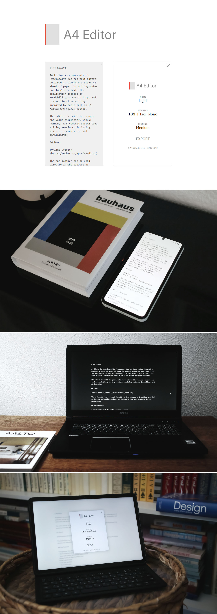

# A4 Editor

A4 Editor is a minimalistic Progressive Web App text editor designed to simulate a clean A4 sheet of paper for writing notes and long-form text. The application focuses on readability, accessibility, and distraction-free writing, inspired by tools such as iA Writer and Calmly Writer.

The editor is built for people who value simplicity, visual harmony, and comfort during long writing sessions, including writers, journalists, and minimalists.

## Demo

[Online version](https://evbkv.ru/apps/a4editor)

The application can be used directly in the browser or installed as a PWA on desktop and mobile devices. An Android APK is also included in the repository.

## Project Philosophy & Origin

A4 Editor was created to solve a very personal problem: the lack of a truly distraction-free writing environment.

The name **A4 Editor** reflects its core concept — a digital equivalent of a blank A4 sheet of paper, familiar to anyone who writes. The goal is simple: remove everything that does not serve the text.

While applications like **iA Writer** and **Calmly Writer** influenced this project, A4 Editor follows a different philosophy. It deliberately does not include paragraph focus mode. In practice, such modes can disrupt the flow of thought by isolating text fragments instead of preserving the integrity of the whole document.

This editor was built primarily:
- for my own note-taking during work and conferences,
- and for my wife, a writer who needs a calm and predictable writing space.

Classic tools like Windows Notepad feel outdated and visually uncomfortable, while many modern editors overload the user with formatting options and UI elements. One of the strongest inspirations came from the focus mode in Apple Pages on an old iBook PowerPC.

My interest in minimalist editors goes back to my first computer — the **Apogey BK-01**. One of the first programs I ever wrote was a simple text editor in machine code. It was fast, responsive, and free from unnecessary complexity — qualities that still define A4 Editor today.

Special attention is paid to accessibility, eye comfort, font choice, and layout proportions. The editor uses the golden ratio to create a balanced text area, making long writing sessions less tiring.

A4 Editor is designed for writers, thinkers, and minimalists — and may eventually evolve through integration with professional writing platforms.

## Key Features

* Progressive Web App with offline support
* Client-side text storage using localStorage
* Automatic saving and manual save control
* Export notes to plain text files (.txt)
* Five color themes
* Five font families
* Three font sizes
* Responsive layout for desktop, tablet, and mobile
* Keyboard shortcuts for common actions

## Design Principles

A4 Editor is designed around readability and accessibility.

* Color contrast follows WCAG AAA standards to reduce eye strain
* Text layout uses the golden ratio (1.618) to create balanced margins
* Line spacing is set to 150 percent for improved readability

The goal is to keep the interface invisible and let the text remain the main focus.

## Themes

Available themes:

1. White
2. Light
3. Sepia
4. Dark
5. Black

Each theme includes carefully selected background and text colors, as well as accent colors for selection and interface elements.

## Fonts

Available font families:

1. IBM Plex Mono
2. IBM Plex Sans
3. IBM Plex Serif
4. Courier Prime
5. Caveat

Font size options:

* Small
* Medium
* Large

Font size and family are saved locally and restored on the next launch.

## Controls and Shortcuts

* Ctrl or Cmd + S: Save text
* Ctrl or Cmd + E: Export text
* Tab: Insert tab character
* Red marker: Save changes
* Gray marker: Open menu

The editor automatically saves changes every minute and when the application loses focus.

## Technology Stack

* HTML5
* CSS3
* JavaScript
* Service Workers for offline support
* Web App Manifest for PWA installation

All data is stored locally in the browser. No server-side processing is used.

## Installation

### PWA Installation

1. Open the online version in a supported browser
2. Use the browser’s install option
3. The app will be available as a standalone application

### Local Installation

1. Clone the repository
2. Open `index.html` in a local web server
3. The app will work offline after the first load

### Android

An Android APK file is included in the `android` directory and can be installed directly on compatible devices.

## Project Status

The project is currently in beta stage. Core functionality is complete, and future improvements may include refactoring, additional font options, and extended platform support.

## Author

[Evgenii Bykov](https://github.com/evbkv)

## License

GNU General Public License v3.0

## Screenshot

